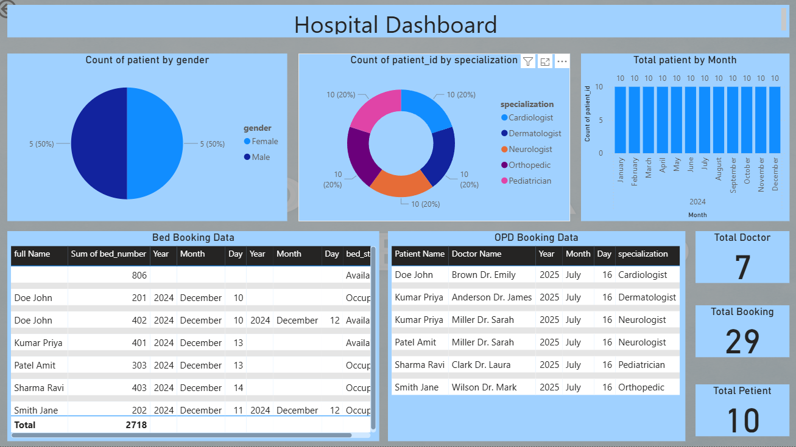

# 🏥 Hospital Dashboard

## 📌 Description
This project is a Hospital Dashboard that visualizes patient, doctor, and booking data in an interactive way.

---

## 🚀 Features
- Patient count by gender (Male vs Female)
- Patient count by specialization
- Monthly patient analysis
- Bed booking data (Available / Occupied)
- OPD booking details
- Summary cards (Total Doctors, Bookings, Patients)

---

## 🛠️ Tech Stack
- Power BI / Excel (update as per your tool)
- Data Visualization
- Dataset (CSV / Excel)

---

## 📊 Dashboard Preview

---

## 📁 Dataset Info
- Contains patient, doctor, and booking data
- Includes fields like Patient Name, Doctor Name, Date, Specialization

---

## ▶️ How to Use
1. Download the file
2. Open in Power BI / Excel
3. Explore the dashboard

---

## 🔮 Future Improvements
- Add real-time data
- Add filters and search
- Improve UI design

---

## 👤 Kamini Gaikwad
Your Name
